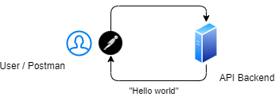
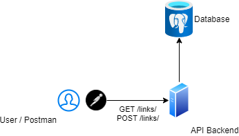

# Проектирование и разработка распределенных программных систем

Лекции и материалы по курсу распределенных систем в ЧелГУ, группа ПрИ-401.

### Лекции

#### Лекция 1. Введение в распределенные системы

[Презентация](https://docs.google.com/presentation/d/1BGF3yyPQVAkaFE7qoRFtt9xMtSWKBaweCB6Bj3sVlc0/edit?usp=sharing)

Зачем нужны распределенные системы, какие проблемы они решают и какие проблемы в них появляются.

**Ссылки**
1. Мартин Клеппман. Высоконагруженные приложения. Программирование, масштабирование, поддержка
2. [Лекции Мартина Клеппмана по распределенным системам в Кембридже](https://martin.kleppmann.com/2020/11/18/distributed-systems-and-elliptic-curves.html)
3. [Distributed systems for fun and profit](http://book.mixu.net/distsys/)
4. [Страх и ненависть в распределённых системах](https://habr.com/ru/post/322876/)

#### Лекция 2. Асинхронное программирование

[Презентация](https://docs.google.com/presentation/d/18CWc4JIaBnL4JozDBHZ0iXwesjRNPq0NVdYqo4fEImg/edit?usp=sharing)

**Ссылки**
1. [Highload++ для начинающих](http://highload.guide/blog/highload-for-beginners.html)
2. [Анатомия веб-сервиса](http://highload.guide/blog/inside-webserver.html)
3. [Метафоры асинхронности в документации FastAPI](https://fastapi.tiangolo.com/async/)
4. [Асинхронщина в JS](https://habr.com/ru/company/oleg-bunin/blog/417461/)

#### Лекция 3. Модели данных

[Презентация](https://docs.google.com/presentation/d/1pWHojbwiXR1LgXTkqCxpArP2BEKYe5BOUvSoiMhOQ7c/edit?usp=sharing)

Реляционные, документоориентированные, графовые, key-value и колоночные БД.

**Ссылки**
1. [NoSQL – коротко о главном](https://habr.com/ru/company/oleg-bunin/blog/319052/)
2. Мартин Клеппман. Высоконагруженные приложения. Программирование, масштабирование, поддержка. Глава 2

#### Лекция 4. Коммуникация приложений

[Презентация](https://docs.google.com/presentation/d/1nSXZ5KifF-_c2tSqD36dhLgV92GRC4ABmbWVXKf4_KI/edit?usp=sharing)

**Ссылки**
1. Хоп Грегор, Вульф Бобби. Шаблоны интеграции корпоративных приложений
2. Сэм Ньюмен. Создание микросервисов, глава 4

#### Лекция 5. Очереди сообщений

[Презентация](https://docs.google.com/presentation/d/1qdmRNu3JuSyRZ5ID-f7dKpyVqoQvLyvJuo8pQpC9pkk/edit?usp=sharing)

**Ссылки**
1. [Принципы и приёмы обработки очередей](https://habr.com/ru/company/oleg-bunin/blog/309332/)
2. [101 способ приготовления RabbitMQ и немного о pipeline архитектуре](https://habr.com/ru/company/oleg-bunin/blog/310418/)
3. [Очереди и блокировки. Теория и практика](https://habr.com/ru/company/oleg-bunin/blog/316458/)

#### Лекция 6. Горизонтальное масштабирование

[Презентация](https://docs.google.com/presentation/d/1r7mFtAwuhAwOeH0tpp2RLtWr1V-XMdLqPu-KDlDPUfY/edit?usp=sharing)

**Ссылки**
1. [Общая логика масштабирования](http://highload.guide/blog/scaling-logic.html)
2. [Масштабирование бэкенда](https://xakep.ru/2012/11/30/backend-zoom/)
3. [Горизонтальное масштабирование. Что, зачем, когда и как](http://highload.guide/blog/scaling-what-why-when-and-how.html)
4. [Как мы сделали ровную балансировку нагрузки на фронтенд-кластере](http://highload.guide/blog/load-balancing-frontend-cluster.html)

### Практика

#### Практика 1. Контейнеризация и Docker

[Презентация](https://docs.google.com/presentation/d/1aw8Tf5dtpBl5d7U3aV2D3qSOpavIRhmhshIkdLrh_ls/edit?usp=sharing)

**Задание**
1. Написать  веб-сервер, который принимает HTTP-запрос и отдает ответ «Hello world»
2. Установить Docker
3. Написать Dockerfile и запустить веб-сервер в докер-контейнере так, чтобы к нему можно было обратиться с хост-машины

**Ссылки**
1. [Установка Docker](https://docs.docker.com/get-docker/)
2. [Документация по Docker](https://docs.docker.com/get-started/)
3. [Документация по Dockerfile](https://docs.docker.com/engine/reference/builder/)
4. [Порядок команд в Dockerfile](https://medium.com/@esotericmeans/optimizing-your-dockerfile-dc4b7b527756)
5. [Multi-stage builds для компилируемых языков](https://docs.docker.com/develop/develop-images/multistage-build/)

#### Практика 2. Взаимодействие контейнеров

[Презентация](https://docs.google.com/presentation/d/1YGD6fijEJ7x7Nb6MfOUtST9V06gzO5M5A6fcJXubFLg/edit?usp=sharing)

**Задание**
1. Дописать приложение, чтобы оно содержало два эндпоинта
  * POST /links — сохраняет ссылку в БД и возвращает ее id
  * GET /links/<id> — отдает ссылку из БД по id
2. Добавить контейнер с PostgreSQL и настроить его взаимодействие с приложением
3. Настроить запуск обоих контейнеров через Docker Compose

**Ссылки**
1. [Postgres по Docker Hub](https://hub.docker.com/_/postgres)
2. [Сеть в Docker](https://docs.docker.com/network/network-tutorial-standalone/)
3. [Volumes в Docker](https://docs.docker.com/storage/volumes/)
4. [Docker Compose](https://docs.docker.com/compose/)
5. [Документация по docker-compose.yml](https://docs.docker.com/compose/compose-file/)
 
 
#### Практика 3. Работа с RabbitMQ

[Презентация](https://docs.google.com/presentation/d/14dNZt9zdrFxqDKRyD2X_hvxvwwmE8dK-5VLBM-z5Zj4/edit?usp=sharing)

**Задание**
1. Добавить контейнер с RabbitMQ
2. В приложении добавить в модель ссылки поле «статус», добавить эндпоинт PUT /links/<id> для обновления статуса ссылки. При добавлении ссылки отправлять ее в очередь сообщений
3. Добавить консьюмер, который слушает очередь сообщений и получает все новые ссылки, делает запрос к ним и сохраняет HTTP-статус ответа через новый эндпоинт приложения. 

**Ссылки**
1. [RabbitMQ на Docker Hub](https://hub.docker.com/_/rabbitmq)
2. [Тьюториал по RabbitMQ](https://www.rabbitmq.com/getstarted.html)
3. [Healthchecks в docker-compose](https://stackoverflow.com/questions/31746182/docker-compose-wait-for-container-x-before-starting-y )
