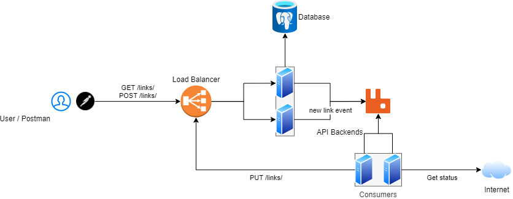
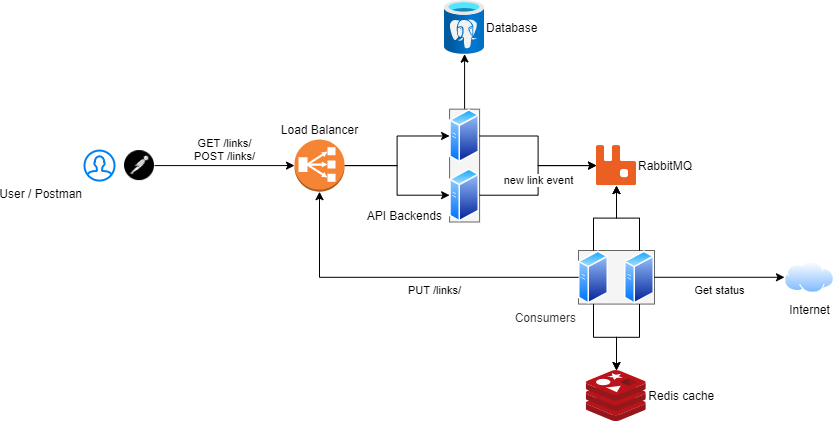
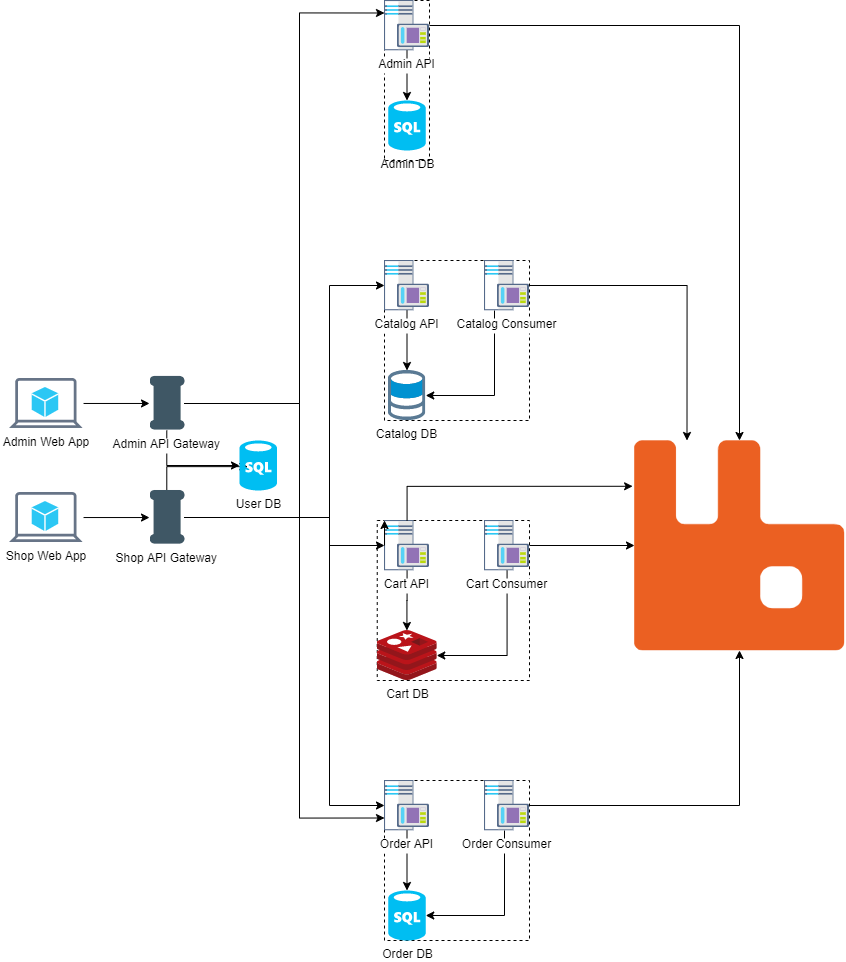
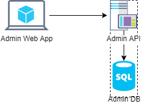
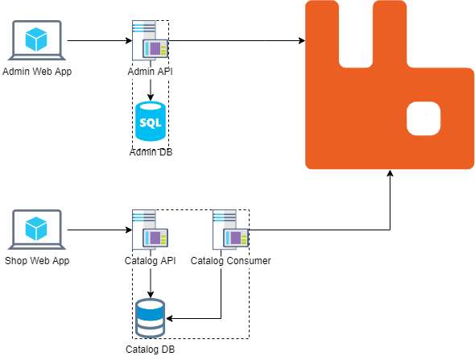
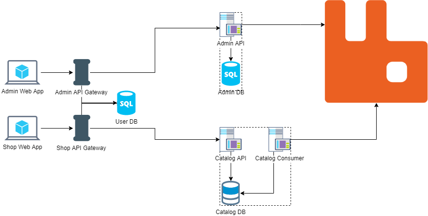
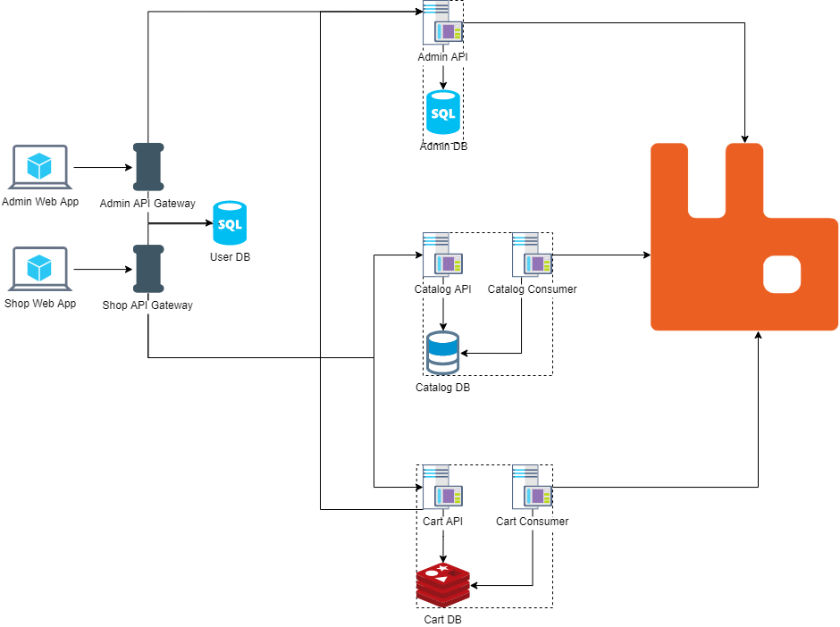

# Проектирование и разработка распределенных программных систем

Лекции и материалы по курсу распределенных систем в ЧелГУ, группа ПрИ-401.

## Первый семестр

### Лекции

#### Лекция 1. Введение в распределенные системы

[Презентация](https://docs.google.com/presentation/d/1BGF3yyPQVAkaFE7qoRFtt9xMtSWKBaweCB6Bj3sVlc0/edit?usp=sharing)

Зачем нужны распределенные системы, какие проблемы они решают и какие проблемы в них появляются.

**Ссылки**
1. Мартин Клеппман. Высоконагруженные приложения. Программирование, масштабирование, поддержка
2. [Лекции Мартина Клеппмана по распределенным системам в Кембридже](https://martin.kleppmann.com/2020/11/18/distributed-systems-and-elliptic-curves.html)
3. [Distributed systems for fun and profit](http://book.mixu.net/distsys/)
4. [Страх и ненависть в распределённых системах](https://habr.com/ru/post/322876/)

#### Лекция 2. Асинхронное программирование

[Презентация](https://docs.google.com/presentation/d/18CWc4JIaBnL4JozDBHZ0iXwesjRNPq0NVdYqo4fEImg/edit?usp=sharing)

**Ссылки**
1. [Highload++ для начинающих](http://highload.guide/blog/highload-for-beginners.html)
2. [Анатомия веб-сервиса](http://highload.guide/blog/inside-webserver.html)
3. [Метафоры асинхронности в документации FastAPI](https://fastapi.tiangolo.com/async/)
4. [Асинхронщина в JS](https://habr.com/ru/company/oleg-bunin/blog/417461/)

#### Лекция 3. Модели данных

[Презентация](https://docs.google.com/presentation/d/1pWHojbwiXR1LgXTkqCxpArP2BEKYe5BOUvSoiMhOQ7c/edit?usp=sharing)

Реляционные, документоориентированные, графовые, key-value и колоночные БД.

**Ссылки**
1. [NoSQL – коротко о главном](https://habr.com/ru/company/oleg-bunin/blog/319052/)
2. Мартин Клеппман. Высоконагруженные приложения. Программирование, масштабирование, поддержка. Глава 2

#### Лекция 4. Коммуникация приложений

[Презентация](https://docs.google.com/presentation/d/1nSXZ5KifF-_c2tSqD36dhLgV92GRC4ABmbWVXKf4_KI/edit?usp=sharing)

**Ссылки**
1. Хоп Грегор, Вульф Бобби. Шаблоны интеграции корпоративных приложений
2. Сэм Ньюмен. Создание микросервисов, глава 4

#### Лекция 5. Очереди сообщений

[Презентация](https://docs.google.com/presentation/d/1qdmRNu3JuSyRZ5ID-f7dKpyVqoQvLyvJuo8pQpC9pkk/edit?usp=sharing)

**Ссылки**
1. [Принципы и приёмы обработки очередей](https://habr.com/ru/company/oleg-bunin/blog/309332/)
2. [101 способ приготовления RabbitMQ и немного о pipeline архитектуре](https://habr.com/ru/company/oleg-bunin/blog/310418/)
3. [Очереди и блокировки. Теория и практика](https://habr.com/ru/company/oleg-bunin/blog/316458/)

#### Лекция 6. Горизонтальное масштабирование

[Презентация](https://docs.google.com/presentation/d/1r7mFtAwuhAwOeH0tpp2RLtWr1V-XMdLqPu-KDlDPUfY/edit?usp=sharing)

**Ссылки**
1. [Общая логика масштабирования](http://highload.guide/blog/scaling-logic.html)
2. [Масштабирование бэкенда](https://xakep.ru/2012/11/30/backend-zoom/)
3. [Горизонтальное масштабирование. Что, зачем, когда и как](http://highload.guide/blog/scaling-what-why-when-and-how.html)
4. [Как мы сделали ровную балансировку нагрузки на фронтенд-кластере](http://highload.guide/blog/load-balancing-frontend-cluster.html)

#### Лекция 7. Кэширование

[Презентация](https://docs.google.com/presentation/d/1MMiWonZWG3UiXm0hsbLD7uQkgkesejCLweZIw_53USo/edit?usp=sharing)

**Ссылки**
1. [Web, кэширование и memcached](http://highload.guide/blog/web-caching-memcached.html)
2. [Кэширование данных в web приложениях. Использование memcached](http://highload.guide/blog/caching-data-in-web-applications.html)
3. [Использование memcached и Redis в высоконагруженных проектах](http://highload.guide/blog/using-memcached-and-redis.html)

#### Лекция 8. Масштабирование БД

[Презентация](https://docs.google.com/presentation/d/1GmBMnAynq22KnbX4UJ5ZrCcVIy3wVNp9Rq_3DIzmWRY/edit?usp=sharing)

**Ссылки**
1. Мартин Клеппман. Высоконагруженные приложения. Программирование, масштабирование, поддержка. Главы 5, 6
2. [Шардинг: паттерны и антипаттерны](https://habr.com/ru/company/oleg-bunin/blog/313366/)

### Практика

#### Практика 1. Контейнеризация и Docker

[Презентация](https://docs.google.com/presentation/d/1aw8Tf5dtpBl5d7U3aV2D3qSOpavIRhmhshIkdLrh_ls/edit?usp=sharing)

**Задание**
1. Написать  веб-сервер, который принимает HTTP-запрос и отдает ответ «Hello world»
2. Установить Docker
3. Написать Dockerfile и запустить веб-сервер в докер-контейнере так, чтобы к нему можно было обратиться с хост-машины

**Ссылки**
1. [Установка Docker](https://docs.docker.com/get-docker/)
2. [Документация по Docker](https://docs.docker.com/get-started/)
3. [Документация по Dockerfile](https://docs.docker.com/engine/reference/builder/)
4. [Порядок команд в Dockerfile](https://medium.com/@esotericmeans/optimizing-your-dockerfile-dc4b7b527756)
5. [Multi-stage builds для компилируемых языков](https://docs.docker.com/develop/develop-images/multistage-build/)

#### Практика 2. Взаимодействие контейнеров

[Презентация](https://docs.google.com/presentation/d/1YGD6fijEJ7x7Nb6MfOUtST9V06gzO5M5A6fcJXubFLg/edit?usp=sharing)

**Задание**
1. Дописать приложение, чтобы оно содержало два эндпоинта
  * POST /links — сохраняет ссылку в БД и возвращает ее id
  * GET /links/<id> — отдает ссылку из БД по id
2. Добавить контейнер с PostgreSQL и настроить его взаимодействие с приложением
3. Настроить запуск обоих контейнеров через Docker Compose

**Ссылки**
1. [Postgres по Docker Hub](https://hub.docker.com/_/postgres)
2. [Сеть в Docker](https://docs.docker.com/network/network-tutorial-standalone/)
3. [Volumes в Docker](https://docs.docker.com/storage/volumes/)
4. [Docker Compose](https://docs.docker.com/compose/)
5. [Документация по docker-compose.yml](https://docs.docker.com/compose/compose-file/)
 
 
#### Практика 3. Работа с RabbitMQ

[Презентация](https://docs.google.com/presentation/d/14dNZt9zdrFxqDKRyD2X_hvxvwwmE8dK-5VLBM-z5Zj4/edit?usp=sharing)

**Задание**
1. Добавить контейнер с RabbitMQ
2. В приложении добавить в модель ссылки поле «статус», добавить эндпоинт PUT /links/<id> для обновления статуса ссылки. При добавлении ссылки отправлять ее в очередь сообщений
3. Добавить консьюмер, который слушает очередь сообщений и получает все новые ссылки, делает запрос к ним и сохраняет HTTP-статус ответа через новый эндпоинт приложения. 

**Ссылки**
1. [RabbitMQ на Docker Hub](https://hub.docker.com/_/rabbitmq)
2. [Тьюториал по RabbitMQ](https://www.rabbitmq.com/getstarted.html)
3. [Healthchecks в docker-compose](https://stackoverflow.com/questions/31746182/docker-compose-wait-for-container-x-before-starting-y )
 

#### Практика 4. Балансировка нагрузки через nginx

[Презентация](https://docs.google.com/presentation/d/1y0E1cD-5RfaBP4vZ6qHscuUCuxb6C4uf6RHPYvUCOdc/edit?usp=sharing)

**Задание**
1. Поднять два отдельных контейнера с API. Каждый из них должен добавлять в ответ собственную метку, чтобы было понятно, какой из контейнеров ответил (например, через HTTP-хедер)
2. Поднять контейнер с nginx, который проксирует запросы на API-контейнеры и балансирует нагрузку между ними

**Ссылки**
1. [nginx на Docker Hub](https://hub.docker.com/_/nginx)
2. [Документация по nginx](http://nginx.org/ru/docs/beginners_guide.html)
3. [Балансировка нагрузки в nginx](http://nginx.org/en/docs/http/load_balancing.html)
 
 
#### Практика 5. Кэширование в Redis

[Презентация](https://docs.google.com/presentation/d/1PQ8ISTOKG_2GTo6U0GfYgXhl-tgnIoSDzHvFkTtW8eM/edit?usp=sharing)

**Задание**
1. Добавить контейнер с Redis
2. Добавить в коде консьюмера использование Redis в качестве кэша для ответов от внешних сервисов

**Ссылки**
1. [Redis на Docker Hub](https://hub.docker.com/_/redis)
2. [Документация по Redis (введение)](https://redis.io/topics/data-types-intro)
 

### Вопросы к экзамену

1. Распределенные системы: какие проблемы они решают и какие новые проблемы возникают в них
2. Асинхронное программирование
3. Модели данных: реляционная модель
4. Модели данных: документная модель
5. Модели данных: графовая модель
6. Модели данных: колоночные БД
7. Взаимодействие компонентов распределенной системы с помощью общей БД
8. Взаимодействие компонентов распределенной системы с помощью удаленного вызова
9. Взаимодействие компонентов распределенной системы с помощью обмена сообщениями
10. Очереди сообщений: протокол AMQP 
11. Горизонтальное и вертикальное масштабирование
12. Принципы разработки горизонтально масштабируемых бэкендов
13. Балансировщики нагрузки
14. Кэширование данных
15. Индексы в БД
16. Денормализация данных в БД
17. Репликация данных в БД: для чего она нужна и как реализуется
18. Репликация данных в БД: проблемы репликации и как они решаются
18. Шардинг данных в БД

 
## Второй семестр

### Лекции

#### Лекция 9. Микросервисы

[Презентация](https://docs.google.com/presentation/d/1e2Rpkt8Hj4tHq1DkE9TLONmiUocZeRFv9vzWp4MTcME/edit?usp=sharing)

**Ссылки**
1. Сэм Ньюмен. Создание микросервисов
2. Александр Бындю. [От микросервисного монолита к оркестратору](https://blog.byndyu.ru/2020/04/blog-post_14.html)
3. Паттерны с [microservices.io](https://microservices.io/): [монолитная архитектура](https://microservices.io/patterns/monolithic.html), [микросервисная архитектура](https://microservices.io/patterns/microservices.html), [API gateway](https://microservices.io/patterns/apigateway.html), [Client-side service discovery](https://microservices.io/patterns/client-side-discovery.html), [Server-side service discovery](https://microservices.io/patterns/server-side-discovery.html)

#### Лекция 10. DDD

[Презентация](https://docs.google.com/presentation/d/1yCG-hT9HZqzWAtol5zuynUdAZ2gM5qMUgPYyxitDshM/edit?usp=sharing)

**Ссылки**

1. Эрик Эванс. Предметно-ориентированное проектирование (DDD). Структуризация сложных программных систем
2. [Domain Driven Design Quickly — краткое содержание книги Эрика Эванса](http://www.infoq.com/minibooks/domain-driven-design-quickly/)
3. [Harry Percival, Bob Gregory. Architecture Patterns with Python](https://www.cosmicpython.com/)
4. [Лекция по DDD на ulearn.me](https://ulearn.me/course/cs2/Chto_takoe_DDD_41922668-4105-4ea0-a1c1-ef138e5441bb)

 
#### Лекция 11. Паттерны работы с БД

[Презентация](https://docs.google.com/presentation/d/1kBwCXDR3_iOaV6duJhOym38rE2hI3FeJKiTIyB6nxRs/edit?usp=sharing)

**Ссылки**
1. [Джимми Богард про агрегаты](https://lostechies.com/jimmybogard/2010/02/24/strengthening-your-domain-aggregate-construction/)
2. [Мартин Фаулер про CQS](https://martinfowler.com/bliki/CommandQuerySeparation.html)
3. [Грег Янг. CQRS Documents](https://cqrs.files.wordpress.com/2010/11/cqrs_documents.pdf)
4. [Уди Дахан. Clarified CQRS](https://udidahan.com/2009/12/09/clarified-cqrs/)  
5. [Александр Бындю. CQRS на практике](https://blog.byndyu.ru/2014/07/command-and-query-responsibility.html)

 
#### Лекция 12. Аутентификация и авторизация

[Презентация](https://docs.google.com/presentation/d/15Wy7MTUTurxw9EVEQb3OJqVz0VjVOM50a0J-jsTzQ4o/edit?usp=sharing)

**Ссылки**
1. Сэм Ньюмен. Создание микросервисов
2. [JSON Web Tokens](https://jwt.io/)

 
#### Лекция 13. Паттерны стабильности

[Презентация](https://docs.google.com/presentation/d/1RIAyr2HAUOFhoExU58qyy06IpgGF4BnqRs6hrbIU2EA/edit?usp=sharing)

**Ссылки**
1. Майкл Нейгард. Release it! Проектирование и дизайн ПО для тех, кому не всё равно
2. [SRE Book](https://sre.google/sre-book/table-of-contents/)
3. [Graceful degradation. Доклад Яндекс.Такси](https://habr.com/ru/company/yandex/blog/438606/)

 
#### Лекция 14. Мониторинг

[Презентация](https://docs.google.com/presentation/d/1oGn4mFHo9kvie3zB59KA3BWB3ydOBRztGdtIRfSl2nI/edit?usp=sharing)

**Ссылки**
1. Сэм Ньюмен. Создание микросервисов
2. [SRE Book](https://sre.google/sre-book/table-of-contents/)
 

### Практика

Разработка интернет-магазина на микросервисах.

#### Практика 6. Админка для микросервисного интернет-магазина

[Презентация](https://docs.google.com/presentation/d/1HiKZo5cClB9Z1AtRtN5ek_LOHbZY_vGlTasvwnRoSQs/edit?usp=sharing)

#### Практика 7. Каталог

[Презентация](https://docs.google.com/presentation/d/1k8qrIqVg5TV2cWZgmjzans92-XN23gKFToKFWnU46pM/edit?usp=sharing)

#### Практика 8. Аутентификация и авторизация

[Презентация](https://docs.google.com/presentation/d/1rlOuTTnmTHb0eBC2JIJjqCjpoxxamhPpQ5brTrMTQRU/edit?usp=sharing)

#### Практика 9. Корзина

[Презентация](https://docs.google.com/presentation/d/1bFLvBWRDm_CEO_c3k4z7Mk35kiR9N7bLYRCT2g8sBpA/edit?usp=sharing)

#### Практика 10. Заказы

[Презентация](https://docs.google.com/presentation/d/1yMKhRRHsqt5IucTAZNRwGkMOQ_OoOc_TuN3uJ_R8l9U/edit?usp=sharing)
 
 
### Итоговая оценка
 
#### Баллы за практические задачи

| Дата сдачи | Админка | Каталог | Авторизация | Корзина | Заказы |
|------------|---------|---------|-------------|---------|--------|
| 24 февраля |      20 |      20 |          20 |      20 |     20 |
|    3 марта |      20 |      20 |          20 |      20 |     20 |
|   10 марта |      15 |      20 |          20 |      20 |     20 |
|   17 марта |      15 |      20 |          20 |      20 |     20 |
|   24 марта |      10 |      15 |          20 |      20 |     20 |
|   31 марта |      10 |      15 |          20 |      20 |     20 |
|   7 апреля |       5 |      10 |          15 |      20 |     20 |
|  14 апреля |       5 |      10 |          15 |      20 |     20 |
|  21 апреля |       5 |       5 |          10 |      15 |     20 |
|  28 апреля |       5 |       5 |          10 |      15 |     20 |
 
#### Перевод баллов в оценку
 
| От | До  | Оценка |
|----|-----|--------|
| 40 |  60 |  **3** |
| 65 |  80 |  **4** |
| 85 | 100 |  **5** |
